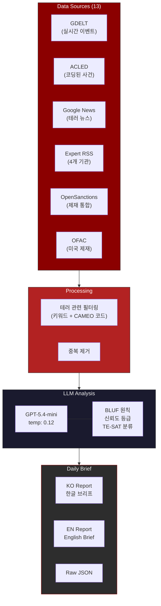
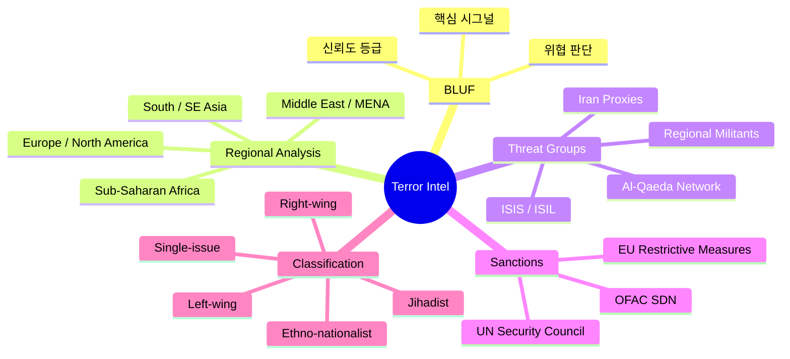
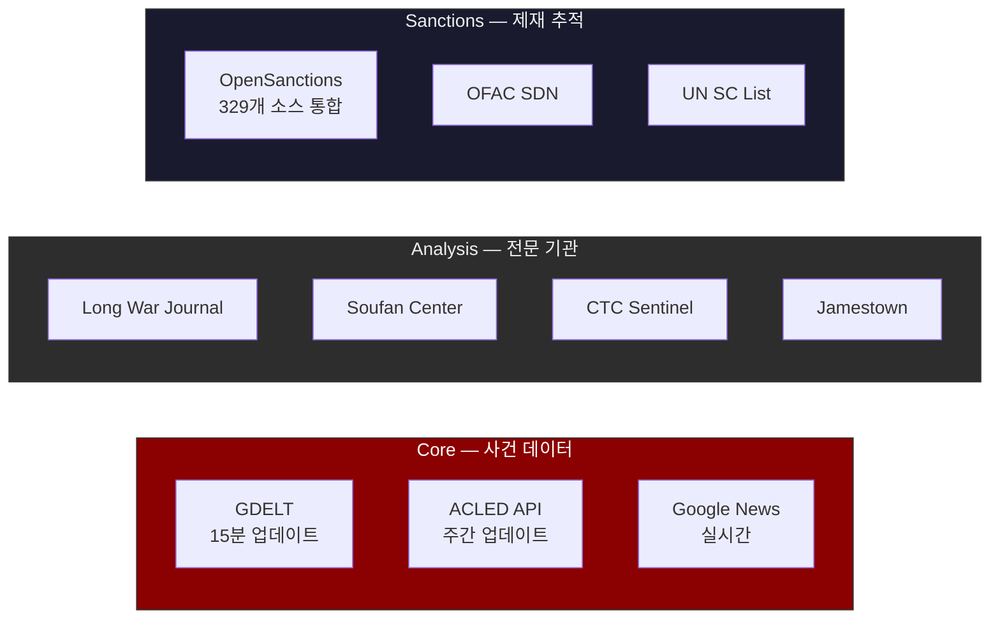

# Terror Researcher

**Automated Daily Terror Intelligence System**

전 세계 테러 사건, 위협 동향, 제재 변동을 자동으로 수집·분석하는 인텔리전스 엔진

---

## 배경

테러 위협은 예고 없이 발생하고, 관련 정보는 ACLED, GDELT, OFAC, UN 제재 목록, 싱크탱크 분석, 뉴스 등 수십 개 채널에 흩어져 있다. 매일 수백 건의 분쟁 이벤트와 수십 편의 전문가 분석이 쏟아지지만, 이를 종합하여 위협 수준을 판단하고 패턴을 읽어내는 건 전문 인력이 아니면 불가능하다. 이 시스템은 13개 소스에서 데이터를 자동 수집하고, LLM이 전문 인텔리전스 브리프 형식으로 분석하여 매일 GitHub에 자동 커밋한다. BLUF(Bottom Line Up Front) 원칙, 신뢰도 등급, EUROPOL TE-SAT 분류 체계를 적용한 전문 분석 리포트를 한글/영문 듀얼로 생성한다.

---

## 무엇을 추적하는가

- **사건 데이터** — 폭탄 공격, IED, 자살 공격, 무장 습격, 드론/미사일 공격 (ACLED + GDELT)
- **조직 동향** — ISIS, Al-Qaeda, 헤즈볼라, 탈레반, 지역 무장단체 활동 패턴
- **지역별 위협** — 중동, 아프리카, 남아시아, 유럽, 북미 위협 수준 평가
- **제재 변동** — OFAC SDN, UN 안보리, EU 제재 목록 신규/변경 추적
- **전문가 분석** — Long War Journal, Soufan Center, CTC Sentinel, Jamestown 등 전문 기관 리서치
- **정책 변화** — 대테러 법안, 국제 협력, 규제 동향

---

## Architecture

---

## 분석 프레임워크

---

## 데이터 소스

---

*Automated terror intelligence — so analysts can focus on judgment, not collection.*

