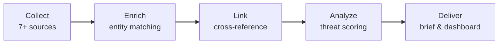
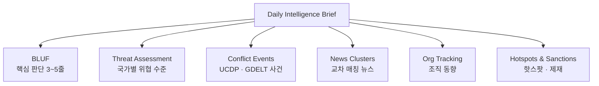

<p align="center">
  <picture>
    <source media="(prefers-color-scheme: dark)" srcset="https://readme-typing-svg.demolab.com?font=Fira+Code&weight=700&size=28&duration=3000&pause=1000&color=FFFFFF&center=true&vCenter=true&width=640&lines=Conflict+%26+Security+Intelligence">
    
  </picture>
</p>

<p align="center">
  <em>Real-time Global Conflict Intelligence Platform</em>
</p>

<p align="center">
  <a href="#about"></a>
  <a href="#data-coverage"></a>
  <a href="#data-coverage"></a>
  <a href="#daily-intelligence-report"></a>
</p>

---

## About

전 세계에서 발생하는 무력 충돌, 테러, 내전, 반란을 **매일 자동으로 수집하고 분석**하는 인텔리전스 플랫폼입니다.

7개 이상의 독립 데이터 소스를 교차 검증하여 단일 소스 편향을 제거하고, 연구자 · 저널리스트 · 정책 분석가 · 안보 전문가에게 **신뢰할 수 있는 분쟁 데이터**를 제공합니다.

---

## Pipeline



<table>
<tr>
<td width="50%" valign="top">

**Collection & Enrichment**

여러 독립 소스에서 분쟁 이벤트를 병렬 수집합니다.
수집된 이벤트는 무장단체 · 국가 · 분쟁지역
데이터베이스와 자동 매칭되어 구조화됩니다.

</td>
<td width="50%" valign="top">

**Analysis & Delivery**

교차 소스 이벤트 클러스터링, 국가별 위협도 산출,
지리적 핫스팟 감지를 수행합니다.
결과물은 웹 대시보드와 일일 보고서로 전달됩니다.

</td>
</tr>
</table>

---

## Architecture

```
                ┌─────────────────────────────────────────────────────────────┐
                │                                                             │
  ╔═══════════╗ │  ┌───────────┐  ┌───────────┐  ┌────────┐  ┌──────────┐   │  ╔════════════╗
  ║  Global   ║─┤  │           │  │           │  │        │  │          │   ├──║  Dashboard ║
  ║ Event DB  ║ │  │ Collector │─▶│ Enricher  │─▶│ Linker │─▶│ Analyzer │   │  ╠════════════╣
  ╠═══════════╣ │  │           │  │           │  │        │  │          │   │  ║  REST API  ║
  ║ Conflict  ║─┤  └───────────┘  └───────────┘  └────────┘  └──────────┘   ├──╠════════════╣
  ║    DB     ║ │                                                             │  ║ Daily Brief║
  ╠═══════════╣ │   parallel        entity         cross        threat        ├──╠════════════╣
  ║ News &    ║─┤   ingestion      matching       reference    scoring        │  ║  Widgets   ║
  ║   RSS     ║ │                                                             │  ╚════════════╝
  ╠═══════════╣ │                                                             │
  ║ Sanctions ║─┤              I N T E L L I G E N C E    E N G I N E        │
  ╠═══════════╣ │                                                             │
  ║   OSINT   ║─┤                                                             │
  ╚═══════════╝ └─────────────────────────────────────────────────────────────┘
    SOURCES                                                                      OUTPUT
```

---

## Dashboard

웹 대시보드에서 전 세계 분쟁 상황을 실시간으로 탐색할 수 있습니다.

| Page | Description |
|:-----|:------------|
| **Home** | 글로벌 현황 — 인터랙티브 지도, 37년 타임라인, 핫스팟, 실시간 피드 |
| **Countries** | 국가별 위협도, 사건 추이, 활동 단체 프로필 |
| **Organizations** | 무장단체 · 테러조직 활동 이력 및 연관 분석 |
| **Categories** | 분쟁 유형별 분류 — 테러, 내전, 반란, 카르텔 등 |
| **Events** | 개별 사건 검색 · 필터링 · 상세 보기 · CSV 내보내기 |
| **Daily Brief** | 일일 인텔리전스 보고서 |
| **Weekly** | 주간 요약 리포트 |
| **Widgets** | 외부 사이트 임베드용 지도 · 피드 · 배지 |

---

## Daily Intelligence Report

매일 자동 생성되는 보고서는 다음과 같은 구조를 따릅니다.



> **BLUF**(Bottom Line Up Front)만 AI가 생성하며, 모든 수치와 분석은 원시 데이터에서 직접 도출됩니다.

---

## Data Coverage

|   | Metric | Detail |
|:--|:-------|:-------|
| **Time** | 1989 — Present | 37년 이상의 분쟁 데이터 |
| **Geography** | 160+ countries | 글로벌 커버리지 |
| **Updates** | Daily | GitHub Actions 자동화 |
| **Classification** | 10 categories | 학술 표준 기반 |
| **Sources** | 7+ independent | 교차 검증 |

---

## API

<details>
<summary><b>Available Endpoints</b></summary>

<br/>

```
GET  /api/stats              글로벌 통계
GET  /api/events             이벤트 검색 & 필터
GET  /api/events/:id         이벤트 상세
GET  /api/countries          국가별 현황
GET  /api/countries/:name    국가 상세
GET  /api/orgs               조직 정보
GET  /api/orgs/:slug         조직 상세
GET  /api/threats            위협 분석
GET  /api/threats/:name      국가별 위협 상세
GET  /api/hotspots           지리적 핫스팟
GET  /api/sparks             스파크라인 데이터
GET  /api/export/csv         CSV 내보내기
GET  /api/status             시스템 상태
```

</details>

---

## Getting Started

```bash
# Clone & setup
git clone https://github.com/lala-david/terror.git && cd terror
pip install -r requirements.txt
cp .env.example .env          # configure API keys

# Run intelligence pipeline
python scripts/daily_terror.py

# Start dashboard
cd web && npm install && npm run dev
```

<details>
<summary><b>Project Structure</b></summary>

<br/>

```
conflict-researcher/
├── scripts/        # Intelligence pipeline
│   ├── sources.py          Collection (7+ sources, parallel)
│   ├── mapper.py           Entity matching & enrichment
│   ├── event_linker.py     Cross-source event clustering
│   ├── threat_scorer.py    Threat analysis & hotspot detection
│   ├── daily_terror.py     Daily pipeline orchestrator
│   └── compute_stats.py    Aggregate statistics
├── web/            # Dashboard & API (Next.js)
├── data/           # Reference data
├── reports/        # Auto-generated intelligence briefs
├── tests/          # Test suite
└── .github/        # CI/CD automation
```

</details>

---

<p align="center">
  This project is for <b>research and educational purposes</b>.<br/>
  All data is sourced from publicly available OSINT providers.
</p>

<p align="center">
  <sub>Built for researchers, analysts, and anyone who believes transparency saves lives.</sub>
</p>
