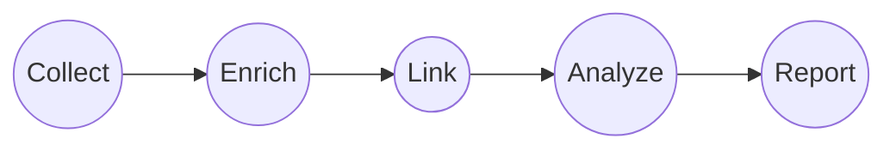
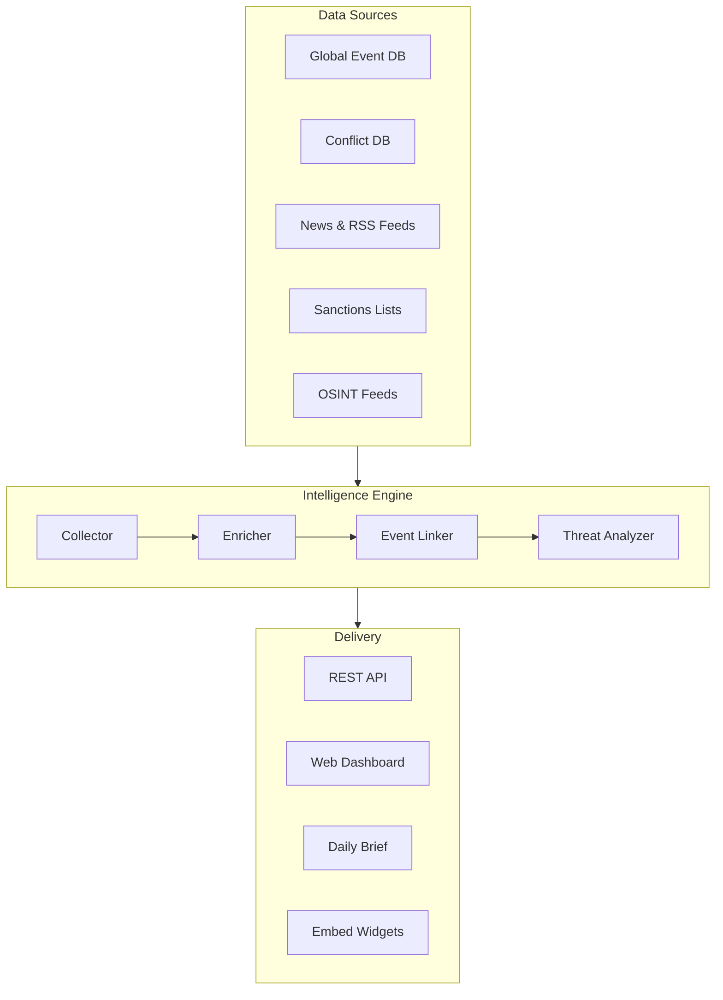
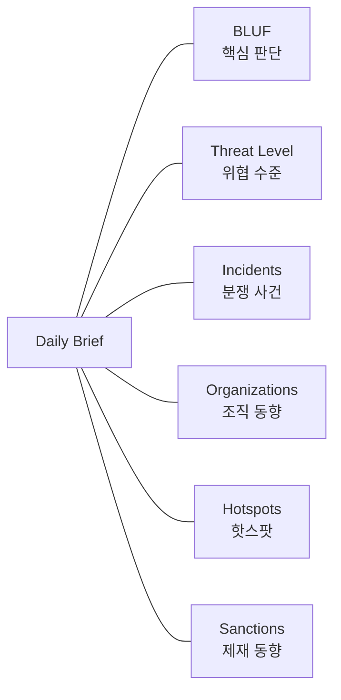
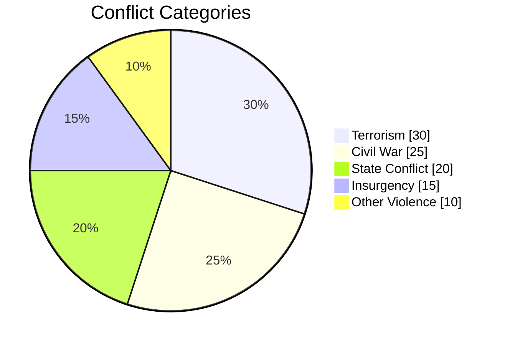

<h1 align="center">
  Conflict Researcher
</h1>

<p align="center">
  <strong>Real-time Global Conflict Intelligence Platform</strong>
</p>

<p align="center">
  Track armed violence, terrorism, and geopolitical threats<br/>
  — updated daily, powered by multi-source intelligence fusion.
</p>

<p align="center">
  
  
  
  
</p>

<br/>

## About

**Conflict Researcher**는 전 세계에서 발생하는 무력 충돌, 테러, 내전, 반란 등을 **매일 자동으로 수집 · 분석 · 시각화**하는 인텔리전스 플랫폼입니다.

여러 독립적인 공개 데이터 소스를 교차 검증하여 **단일 소스 편향 없는** 신뢰도 높은 분쟁 데이터를 제공하며, 연구자 · 저널리스트 · 정책 분석가 · 안보 전문가를 위해 설계되었습니다.

<br/>

## How It Works



> **Collect** — 7개 이상의 독립 소스에서 병렬 수집
> **Enrich** — 국가 · 조직 · 분쟁지역 자동 매칭
> **Link** — 교차 소스 이벤트 클러스터링
> **Analyze** — 위협도 산출 · 핫스팟 감지
> **Report** — 대시보드 + 일일 브리핑 자동 생성

<br/>

## Architecture



<br/>

## Features

<table>
  <tr>
    <td width="50%">
      <h3>Intelligence Pipeline</h3>
      <ul>
        <li><b>Multi-Source Fusion</b> — 단일 소스 편향 제거</li>
        <li><b>Entity Matching</b> — 무장단체 · 국가 자동 식별</li>
        <li><b>Event Clustering</b> — 교차 소스 동일 사건 인식</li>
        <li><b>Threat Scoring</b> — 국가별 위협도 자동 산출</li>
        <li><b>Hotspot Detection</b> — 지리적 위험 지역 감지</li>
      </ul>
    </td>
    <td width="50%">
      <h3>Web Dashboard</h3>
      <ul>
        <li><b>Interactive Map</b> — 좌표 기반 글로벌 시각화</li>
        <li><b>Country Profiles</b> — 국가별 위협도 · 사건 추이</li>
        <li><b>Organization Tracker</b> — 무장단체 활동 이력</li>
        <li><b>Event Search</b> — 필터링 · 검색 · CSV 내보내기</li>
        <li><b>Embed Widgets</b> — 외부 사이트 임베드 지원</li>
      </ul>
    </td>
  </tr>
</table>

<br/>

## Daily Intelligence Report

매일 자동으로 생성되는 인텔리전스 보고서 구조:



> 보고서는 코드 기반으로 자동 구조화되며, 핵심 판단 요약(BLUF)만 AI가 생성합니다.
> 모든 수치와 분석은 원시 데이터에서 직접 도출됩니다.

<br/>

## Data Coverage



|  | Metric | |
|---|---|---|
| **Time Span** | 1989 — Present | 37 years of conflict data |
| **Geography** | 160+ countries | Global coverage |
| **Updates** | Daily | Automated via CI/CD |
| **Categories** | 10 types | Academic standard classification |
| **Sources** | 7+ independent | Cross-validated |

<br/>

## API

```
GET  /api/stats              Global statistics
GET  /api/events             Search & filter events
GET  /api/countries          Country profiles
GET  /api/orgs               Organization data
GET  /api/threats            Threat analysis
GET  /api/hotspots           Geographic hotspots
GET  /api/export/csv         Data export
```

<br/>

## Getting Started

```bash
# Clone
git clone https://github.com/lala-david/terror.git && cd terror

# Backend
pip install -r requirements.txt
cp .env.example .env          # Add your API keys

# Run pipeline
python scripts/daily_terror.py

# Web dashboard
cd web && npm install && npm run dev
```

<br/>

## Project Structure

```
conflict-researcher/
├── scripts/        Intelligence pipeline (collection, enrichment, analysis)
├── web/            Dashboard & API (Next.js)
├── data/           Reference data (organizations, countries, conflict zones)
├── reports/        Auto-generated intelligence briefs
├── tests/          Test suite
└── .github/        CI/CD (daily automated runs)
```

<br/>

---

<p align="center">
  <sub>
    This project is for <b>research and educational purposes only</b>.<br/>
    All data is sourced from publicly available open-source intelligence (OSINT) providers.
  </sub>
</p>

<p align="center">
  <sub>Built for researchers, analysts, and anyone who believes transparency saves lives.</sub>
</p>
