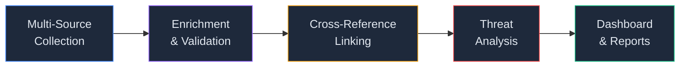
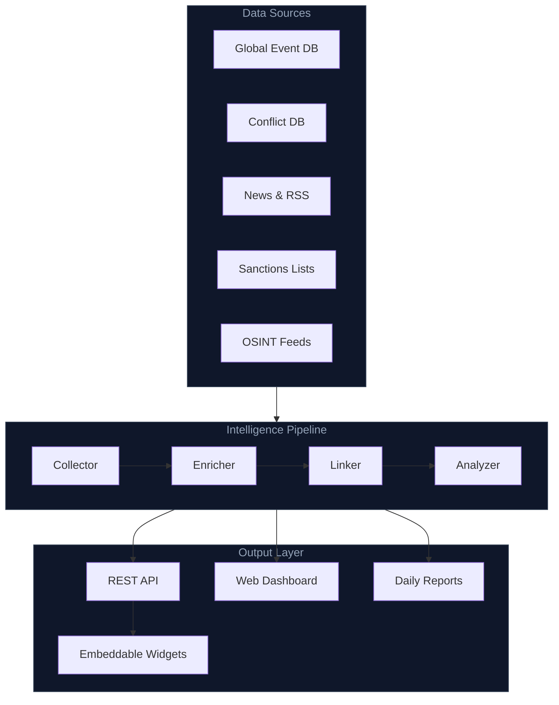
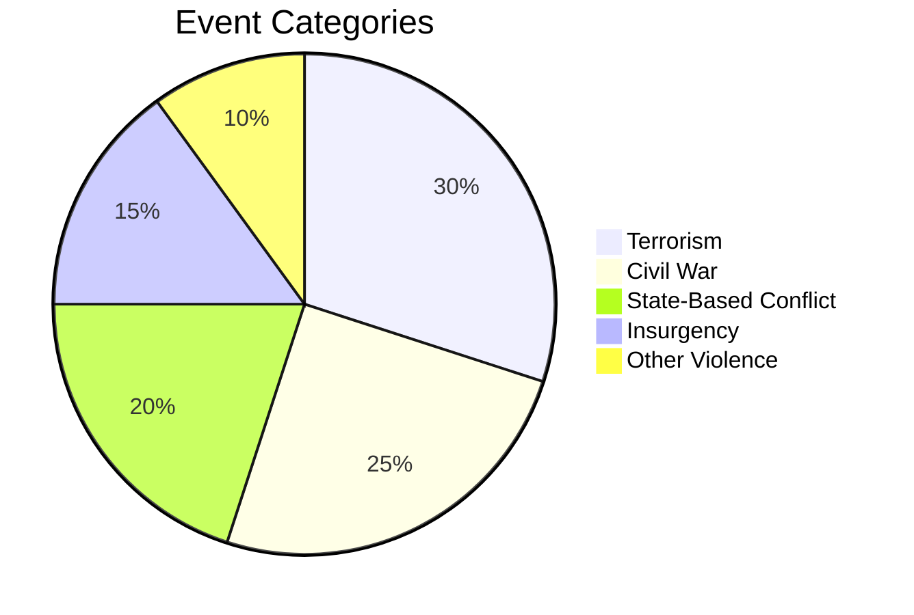
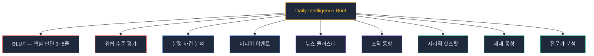

<p align="center">
  
  
  
  
</p>

# Conflict Researcher

> Real-time global conflict intelligence platform.
> Track armed violence, terrorism, and geopolitical threats — updated daily, powered by multi-source intelligence fusion.

---

## What is this?

**Conflict Researcher**는 전 세계에서 발생하는 무력 충돌, 테러, 내전, 반란 등을 **매일 자동으로 수집 · 분석 · 시각화**하는 인텔리전스 플랫폼입니다.

여러 공개 데이터 소스를 교차 검증하여 신뢰도 높은 분쟁 데이터를 제공하며, 연구자 · 저널리스트 · 정책 분석가 · 안보 전문가를 위해 설계되었습니다.

```
"한 곳에서 전 세계 분쟁 상황을 파악한다"
```

---

## Core Features



### Intelligence Pipeline

| | Feature | Description |
|---|---------|-------------|
| :satellite: | **Multi-Source Fusion** | 7개 이상의 독립 소스를 병렬 수집하여 단일 소스 편향을 제거 |
| :dart: | **Entity Matching** | 무장단체, 국가, 분쟁지역을 자동 식별하고 교차 매칭 |
| :bar_chart: | **Threat Scoring** | 국가별 · 지역별 위협도를 자동 산출 |
| :world_map: | **Geospatial Mapping** | 160개국 이상의 분쟁 이벤트를 좌표 기반으로 시각화 |
| :newspaper: | **Daily Briefing** | 매일 자동 생성되는 인텔리전스 보고서 (BLUF 포함) |
| :link: | **Event Clustering** | 여러 소스에서 동일 사건을 자동 인식하고 클러스터링 |

---

## Architecture



---

## Dashboard

### Web Application

대시보드는 다음과 같은 페이지로 구성됩니다:

| Page | Description |
|------|-------------|
| **Home** | 글로벌 현황 요약 — 지도, 타임라인, 핫스팟, 실시간 피드 |
| **Countries** | 국가별 위협도, 사건 추이, 활동 단체 |
| **Organizations** | 무장단체 · 테러조직 프로필 및 활동 이력 |
| **Categories** | 분쟁 유형별 분류 (테러, 내전, 반란, 카르텔 등) |
| **Events** | 개별 사건 검색 · 필터링 · 상세 보기 |
| **Daily Brief** | 일일 인텔리전스 보고서 열람 |
| **Weekly** | 주간 요약 리포트 |
| **Widgets** | 외부 임베드용 위젯 (지도, 피드, 배지) |

---

## Data Coverage



- **시간 범위**: 1989년 ~ 현재 (37년+)
- **지리 범위**: 160개국 이상
- **업데이트**: 매일 자동 (GitHub Actions CI/CD)
- **분류 체계**: 학술 표준 기반 10개 카테고리

---

## API

RESTful API를 통해 데이터에 프로그래밍 방식으로 접근할 수 있습니다.

```
GET /api/stats          — 글로벌 통계
GET /api/events         — 이벤트 검색 & 필터
GET /api/countries      — 국가별 현황
GET /api/orgs           — 조직 정보
GET /api/threats        — 위협 분석
GET /api/hotspots       — 지리적 핫스팟
GET /api/export/csv     — CSV 내보내기
```

---

## Intelligence Report

매일 자동으로 생성되는 보고서의 구조:



---

## Quick Start

```bash
# 1. Clone
git clone https://github.com/lala-david/terror.git
cd terror

# 2. Install dependencies
pip install -r requirements.txt

# 3. Set environment variables
cp .env.example .env
# Edit .env with your API keys

# 4. Run daily pipeline
python scripts/daily_terror.py

# 5. Start web dashboard
cd web && npm install && npm run dev
```

---

## Project Structure

```
terror/
├── scripts/          # Intelligence pipeline
├── web/              # Dashboard (Next.js)
├── data/             # Database & reference data
├── reports/          # Generated intelligence briefs
├── tests/            # Test suite
└── .github/          # CI/CD automation
```

---

## License

This project is for **research and educational purposes only**.

Data is sourced from publicly available open-source intelligence (OSINT) providers.

---

<p align="center">
  <sub>Built for researchers, analysts, and anyone who believes transparency saves lives.</sub>
</p>
